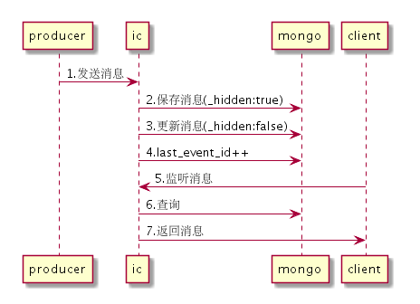

[上一页](install.md)
[回目录](../../README.md)
[下一页](table.md)

# 架构概览
下图是消息从产生到消费的时序图:

* IC 本服务
* MongoDB 存储消息的数据库
* producer 消息生产者
* consumer 消息消费者

根据图中的编号描述一下其交互过程
1. producer向IC推送消息
2. IC将消息内容进行处理，并添加一些固定字段，其中将_hidden设置为true，即此时该消息不会被消费者消费
3. 另一个线程将连续的待被消费的消息的_hidden字段更新成false，从而保证消息会按顺序被消费，且不会丢失消息
4. 更新数据库中last_event_id，即最后一个可被消费的消息id
5. consumer轮询/长轮询监听消息
6. IC查询数据库获取新消息
7. IC返回新消息给consumer

[上一页](install.md)
[回目录](../../README.md)
[下一页](table.md)
