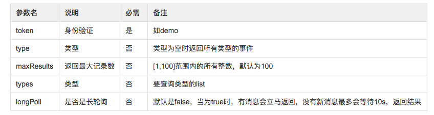
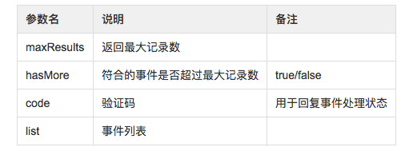

[上一页](producer.md)
[回目录](../../README.md)
[下一页](query.md)


# 消费消息(consumer)

### 发送GET请求监听消息

GET /api/v2/event/listener/{token}?type=student-chooseClasses&longPoll=true

请求参数说明



ps：新的消费者token可以自定义传入，只要和其他消费者的token不重复就可以

返回值


```json
{
  "code": "cd007e2e-fda5-4508-b4ca-588d326385ab",
  "list": [
      {
        "id": 7683203,
        "type": "student-chooseClasses",
        "event": "student-chooseClasses",
        "operator": "san.zhang",
        "source": "courseSelectionSystem",
        "time": "2017-12-06T18:15:33+08:00",
        "timestamp": 1512555333139,
        "updated": "2018-12-17T19:59:27+08:00",
        "updatedTimestamp": 1545047967933,
        "userName": "san.zhang",
        "classes": [
          "math",
          "english",
          "chinese"
        ],
        "age": 14,
        "sex": "male",
        "hobby": "basketball"
      }
  ],
  "maxResults": 100,
  "hasMore": false
}
```

## 消费成功发ACK确认
POST /api/v2/event/listener/{token}/{code}

* token是监听时传入的token
* code是监听时返回的code

返回值

```json
{
  "message": "success"
}
```

[上一页](producer.md)
[回目录](../../README.md)
[下一页](query.md)
