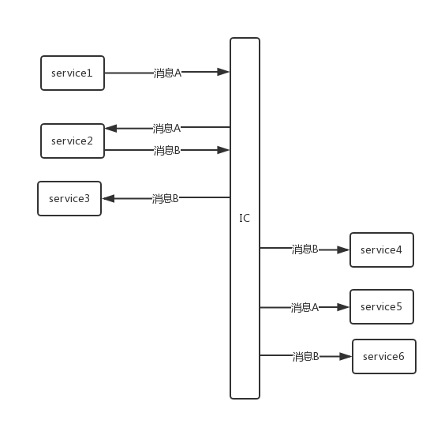

[上一页](install.md)
[回目录](../../README.md)
[下一页](table.md)

# 设计背景

### 真实使用场景
在我们工程效率团队，有大量的CI、CD、DevOps工具，如何能够实现工具解耦，且在短期实现自动化？其实只需要一个消息总线。

### 消息总线
消息总线，简单理解就是一个消息中心，众多微服务实例可以连接到总线上，实例可以往消息中心发送或接收消息（通过监听）。比如：实例1发送一条消息到总线上，总线上的实例2可以接收到消息（实例2监听了实例1发送的消息类型），这样的话，消息总线就充当一个中间者的角色，使得实例1和实例2解偶了，很方便。

### 不直接使用现有的消息中间件原因
去哪儿内部已经存在了工程师广泛使用的消息中间件QMQ，java的工程能够很方便地通过引入jar包和注解的方式发送和接收QMQ消息，但是对于公司内部相对小众语言，比如：python、nodejs等开发人员来说，享受不到QMQ带来的便利，需要一个跨语言跨平台的消息系统。IC由此诞生，它不仅仅解决了跨语言的消息传递问题，还是一个大数据中心。而且在去哪儿内部和QMQ相结合，使python系统和java系统都能够便利地发送和接收消息（主要是python系统发送消息，java系统接收消息）。

[上一页](install.md)
[回目录](../../README.md)
[下一页](table.md)
