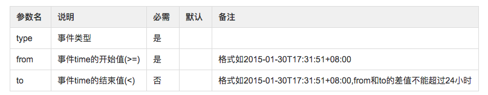

[上一页](consumer.md)
[回目录](../../README.md)
[下一页](advance.md)

# 查询消息

## 根据时间范围查询
GET /api/v2/event?type=student-chooseClasses&from=2018-01-30T17:31:51%2b08:00&to=2018-01-31T17:31:51%2b08:00

请求参数说明


成功返回值
状态码 200

```json
[
   {
      "id": 7683203,
      "type": "student-chooseClasses",
      "event": "student-chooseClasses",
      "operator": "san.zhang",
      "source": "courseSelectionSystem",
      "time": "2017-12-06T18:15:33+08:00",
      "timestamp": 1512555333139,
      "updated": "2018-12-17T19:59:27+08:00",
      "updatedTimestamp": 1545047967933,
      "userName": "san.zhang",
      "classes": [
        "math",
        "english",
        "chinese"
      ],
      "age": 14,
      "sex": "male",
      "hobby": "basketball"
   }
]

```
失败返回值
状态码 400
```json
{
  "message": "查询时间范围不能超过一天"
}
```

## 根据id查询事件
GET /api/v2/event/{id}

成功返回值
状态码 200
```json
{
    "id": 7683203,
    "type": "student-chooseClasses",
    "event": "student-chooseClasses",
    "operator": "san.zhang",
    "source": "courseSelectionSystem",
    "time": "2017-12-06T18:15:33+08:00",
    "timestamp": 1512555333139,
    "updated": "2018-12-17T19:59:27+08:00",
    "updatedTimestamp": 1545047967933,
    "userName": "san.zhang",
    "classes": [
      "math",
      "english",
      "chinese"
    ],
    "age": 14,
    "sex": "male",
    "hobby": "basketball"
}

```

失败返回值
状态码 400
```json
{
  "message": "[参数错误]事件166129不存在"
}
```

[上一页](consumer.md)
[回目录](../../README.md)
[下一页](advance.md)